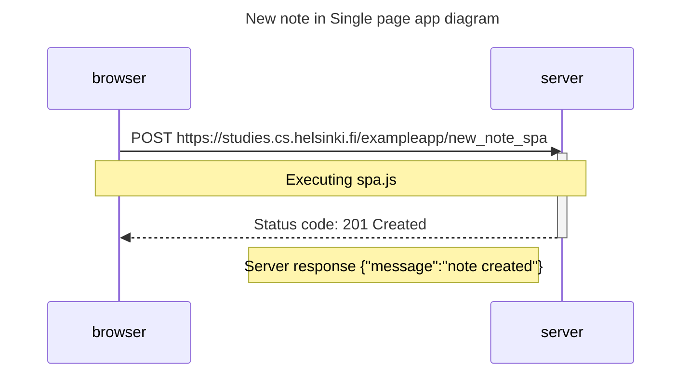

```mermaid
sequenceDiagram
participant browser
participant server

title New note in Single page app diagram

    browser->>server: POST https://studies.cs.helsinki.fi/exampleapp/new_note_spa
    activate server
    Note over browser,server: Executing spa.js;
    server-->>browser: Status code: 201 Created
    deactivate server   
    Note left of server: Server response {"message":"note created"}
```
